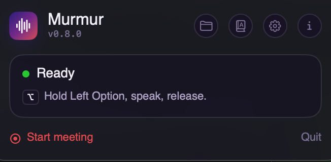
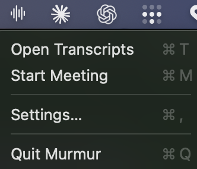
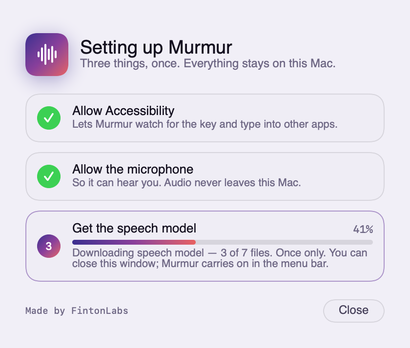
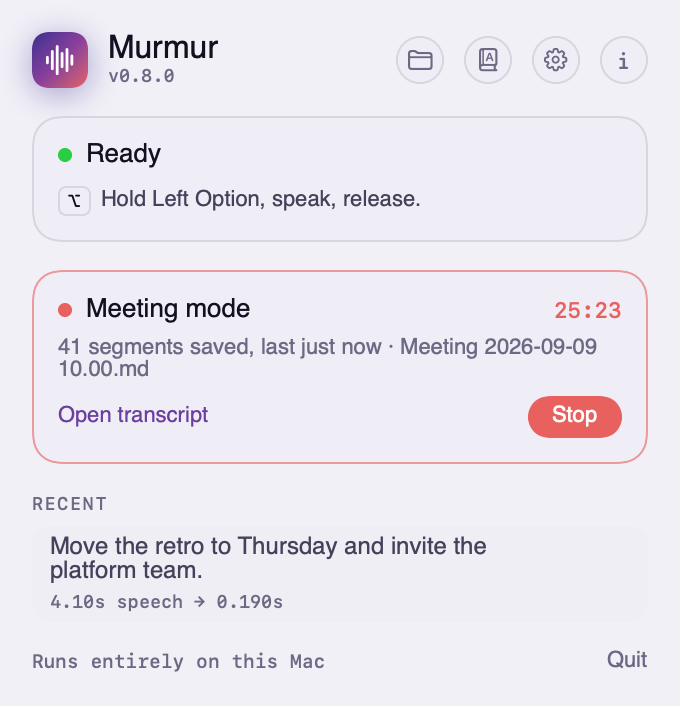
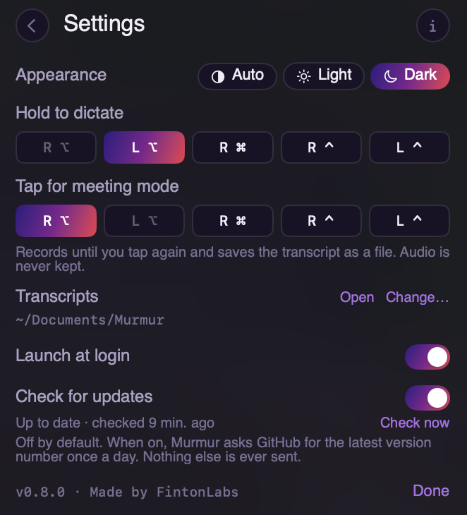
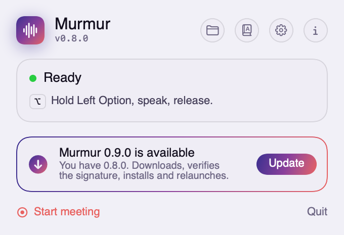

<div align="center">
  
  <h1>Murmur</h1>
  <p><strong>Offline dictation and meeting transcription for macOS.</strong></p>
  <p>
    <a href="https://github.com/justynroberts/murmur/releases/latest"><strong>Download</strong></a> ·
    <a href="https://justynroberts.github.io/murmur/">Website</a> ·
    <a href="#install">Install</a> ·
    <a href="#dictate">Dictate</a> ·
    <a href="#meetings">Meetings</a> ·
    <a href="#settings">Settings</a>
  </p>
</div>

Hold a key, speak, release: cleaned-up text lands in whatever app you were typing in.
Tap another key and Murmur records a meeting to a file until you tap again.

Nothing leaves your Mac. No account, no subscription, no network access after the
one-time model download unless you switch on the optional update check.

<p align="center">
  
  
</p>

## Install

Requires macOS 14 or later on Apple Silicon.

1. **Download** [the latest disk image](https://github.com/justynroberts/murmur/releases/latest)
   and drag Murmur into Applications. It is signed and notarised, so it opens without a
   Gatekeeper warning.
2. **Open Murmur.** A setup window appears and walks through the rest. Grant
   **Accessibility** and **Microphone** with the Open Settings buttons; Accessibility is
   what lets it watch for the key and type into other apps. It carries on by itself the
   moment each is granted.
3. **Let it fetch the speech model.** About 450MB, downloaded once as a single file from
   GitHub, then under a minute to compile for the Neural Engine. The window shows
   progress; close it if you like and the menu bar icon takes over.

<p align="center">
  
</p>

After that, Murmur lives in the menu bar. Turn on **Launch at login** in Settings and you
never have to think about it again.

**If the key does nothing**, it is almost always Accessibility. System Settings →
Privacy & Security → Accessibility → enable Murmur. If it is already on, remove the entry
and add it back. See [Troubleshooting](docs/TROUBLESHOOTING.md) for the rest.

## The menu bar icon

<p align="center">
  
</p>

The icon tells you what is happening without opening anything: plain when ready, a coral
waveform while you hold the key, a record glyph the whole time a meeting is on, and dimmed
or badged while setting up or if something is wrong.

**Left-click** opens the panel. **Right-click** gives you the day-to-day actions without it:
Open Transcripts, Start or Stop Meeting, Settings, Quit.

## Dictate

Hold **Left Option**, speak, release. The text appears wherever your cursor is, in any app.

- A short tap does nothing, so an accidental press never fires an empty transcription.
- Speaking during first-run setup is fine: the audio is queued and typed the moment setup
  finishes.
- Cleanup is deliberately conservative. Filler sounds like "um" and "erm" are removed,
  sentences are capitalised and ended, and nothing else is touched. A stray "so" is far
  better than a lost clause.
- Nothing you dictate is saved anywhere. Only the last three appear in the panel, with the
  time they took.

If the text lands nowhere, a password field probably has focus. macOS blocks every app
from typing while Secure Input is on, and Murmur says so in the panel.

### Words it gets wrong

Product names it splits ("pager duty") and names spelled the common way ("Justin") are
fixed once, in a word list. Click the **book icon** in the panel to open it:

```json
{
  "pager duty": "PagerDuty",
  "justin": "Justyn"
}
```

Changes apply on the next dictation. Your spelling wins, so "npm" stays "npm" even at the
start of a sentence.

## Meetings

Tap **Right Option** and Murmur records until you tap again. Nothing is typed anywhere.
The transcript is written to a file as you go.

<p align="center">
  
</p>

- **One file per meeting**, in `~/Documents/Murmur` unless you choose another folder,
  named for when it started: `Meeting 2026-09-09 10.00.md`. The start time is in the
  header and the end time and length in the footer. Plain Markdown, so Obsidian, Spotlight
  or any editor can read it.
- **Saved as you go.** Each segment is written and forced to disk the moment it is
  transcribed, and the file is forced to disk every minute on top. The panel shows how many
  segments are saved and how long ago.
- **A flat battery loses nothing.** Audio for the segment being spoken is spooled to disk
  until its words are safely written. Open Murmur again after a crash or a power cut and
  it transcribes what was left and appends it under a "Recovered after an interruption"
  heading. Audio is never kept beyond that.
- **Stops on sleep and on quit**, and does not restart by itself.
- A tap is a press and release with nothing else in between, so pressing another key
  while the modifier is down is treated as a shortcut, not a tap.

To get at transcripts: the **folder icon** in the panel, **Open transcript** on the meeting
card, or **Open Transcripts** from the right-click menu.

You can also start and stop from a script or a Shortcut:

```bash
/Applications/Murmur.app/Contents/MacOS/Murmur meeting start
/Applications/Murmur.app/Contents/MacOS/Murmur meeting stop
```

## Settings

The **gear icon** in the panel, or Settings from the right-click menu.

<p align="center">
  
</p>

| Setting | What it does |
|---|---|
| Appearance | Auto, light or dark. |
| Hold to dictate | Which modifier to hold. Left Option by default. |
| Tap for meeting mode | Which modifier to tap. Right Option by default. The two can never be the same key. |
| Transcripts | Where meeting files go. Open it, or change it. |
| Launch at login | Keeps Murmur in the menu bar after a restart. |
| Check for updates | **Off by default.** When on, asks GitHub for the latest version number once a day and sends nothing else. |

Fn/Globe is not offered as a key because a bare press fires the emoji picker or Apple's
own dictation on release, and Shift is not offered because holding it is how capitals
happen.

## Updating

With the update check on, a new version appears in the panel. **Update** downloads it,
checks the new copy carries the same Developer ID signature as the one you are running,
installs it and relaunches. It refuses to do this during a meeting. Nothing is downloaded
until you press the button.

<p align="center">
  
</p>

With the check off, new versions are on the
[releases page](https://github.com/justynroberts/murmur/releases); About links there.

## How it works, briefly

```
key held      →  CGEventTap  →  AVAudioEngine @ 16kHz
key released  →  Parakeet TDT v2 (CoreML, Neural Engine)  →  rule-based cleanup
              →  pasteboard + Cmd-V into the frontmost app        (dictation)
              →  appended to a Markdown file                       (meeting)
```

A short utterance transcribes in **0.176s** on an M1, faster than the network round trip a
cloud service pays before its model starts. The model runs through
[FluidAudio](https://github.com/FluidInference/FluidAudio), pure Swift, no Python sidecar,
a 16MB binary.

After the models load the network is locked off: any later network call throws rather
than quietly succeeding. Check it yourself:

```bash
swift run Murmur selftest test_short.wav --offline
```

## Build from source

```bash
git clone https://github.com/justynroberts/murmur.git && cd murmur
swift build -c release
./Scripts/bundle.sh release
open Murmur.app
```

Always run `bundle.sh` after a build. macOS ties the Accessibility grant to the bundle and
its signature, so the bare binary never gets one.

## Documentation

| | |
|---|---|
| [Architecture](ARCHITECTURE.md) | How the loop fits together, why each piece is the way it is, and what will bite you |
| [Benchmarks](docs/BENCHMARKS.md) | Every measurement behind the design decisions |
| [Troubleshooting](docs/TROUBLESHOOTING.md) | Permissions, Secure Input, Electron limitations, recovery |
| [Releasing](docs/RELEASING.md) | Signing, notarisation, and the one command that publishes |
| [Design](DESIGN.md) | Visual language for the menu bar interface |

## Licence

MIT — Copyright (c) fintonlabs.com
